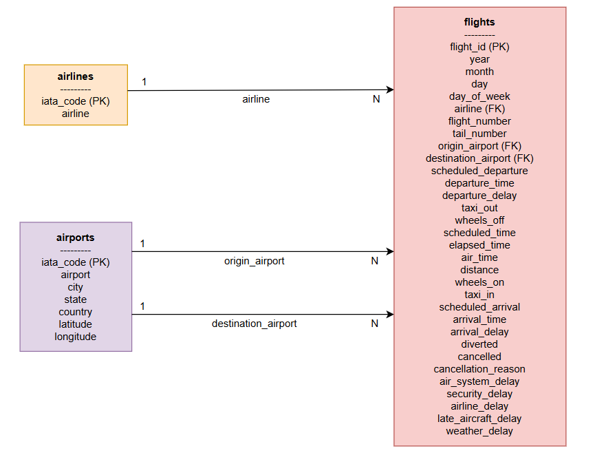

# Flights Data Engineering End-to-End

Proyecto de ingeniería de datos de punta a punta sobre el dataset de vuelos domésticos de Estados Unidos en 2015.  
El objetivo fue construir un pipeline completo desde archivos CSV crudos hasta análisis en Athena, modelado relacional en PostgreSQL y un notebook con consultas, regresión lineal y pronóstico de series de tiempo.

## Objetivo

Implementar un pipeline con arquitectura **Medallion**:
- **Bronze**: ingesta de datos crudos en S3 y registro en Glue Data Catalog
- **Silver**: transformaciones y agregaciones analíticas en Parquet + Snappy
- **Gold**: tabla desnormalizada lista para análisis con CTAS en Athena
- **PostgreSQL**: modelo relacional con `airlines`, `airports` y `flights`
- **Notebook**: consultas, visualizaciones, regresión OLS y pronóstico de series de tiempo

---

## Estructura del repositorio

```text
flights-data-engineering-a/
├── README.md
├── .gitignore
├── docs/
│   ├── erd-flights.drawio
│   ├── erd-flights.png
│   └── screenshots/
├── etl/
│   ├── bronze.py
│   ├── silver.py
│   ├── gold.py
│   └── postgres_load.py
├── infra/
│   └── rds-flights.yaml
└── flights_analytics.ipynb

```
---

## Dataset

El dataset contiene tres archivos principales:
- flights.csv: registro por vuelo
- airlines.csv: catálogo de aerolíneas
- airports.csv: catálogo de aeropuertos

## 1. Ingesta de datos

Los datos se descargaron desde el bucket público del curso:

aws s3 cp s3://itam-analytics-dante/flights-hwk/flights.zip . --no-sign-request
unzip flights.zip -d data/

Se agregó data/ al .gitignore para evitar subir archivos crudos al repositorio.

## 2. ETL Medallion

## Bronze
Script: etl/bronze.py

Responsabilidades:
- crear la base flights_bronze en Glue
- cargar airlines, airports y flights a S3
- registrar las tablas en Glue Data Catalog
- usar Parquet + Snappy
- mantener idempotencia

Ejecución:
- python etl/bronze.py --bucket itam-analytics-diana --data-dir data/

<p><strong>Evidencia Bronze</strong></p>

<p>Base <code>flights_bronze</code> creada en Glue con las tres tablas crudas registradas.</p>


<br><br>
<p>Tabla <code>airlines</code> cargada correctamente en Bronze.</p>


<br><br>
<p>Tabla <code>airports</code> cargada correctamente en Bronze.</p>


<br><br>
<p>Tabla <code>flights</code> cargada correctamente en Bronze.</p>


## Silver

Script: etl/silver.py

Responsabilidades:
- crear la base flights_silver
- construir: flights_daily, flights_monthly y flights_by_airport
- escribir en S3 con Parquet + Snappy
- particionar flights_daily por month

Ejecución:

- python etl/silver.py --bucket itam-analytics-diana

<p><strong>Evidencia Silver</strong></p>

<p>Base <code>flights_silver</code> creada en Glue con las tres tablas agregadas.</p>


<br><br>
<p>Tabla <code>flights_by_airport</code> registrada correctamente en Glue.</p>


<br><br>
<p>Tabla <code>flights_daily</code> registrada correctamente en Glue.</p>


<br><br>
<p>Tabla <code>flights_monthly</code> registrada correctamente en Glue.</p>


<br><br>
<p>Particiones de <code>flights_daily</code> por <code>MONTH</code>.</p>


## Gold

Script: etl/gold.py

Responsabilidades:
- crear la base flights_gold
- construir vuelos_analitica con CTAS en Athena
- unir: flights_bronze.flights, flights_bronze.airlines, flights_bronze.airports como origen y flights_bronze.airports como destino

Ejecución:

- python etl/gold.py --bucket itam-analytics-diana

<p><strong>Evidencia Gold</strong></p>

<p>Base <code>flights_gold</code> y tabla <code>vuelos_analitica</code> registradas correctamente en Glue Data Catalog.</p>


<br><br>
<p>Validación en Athena de la tabla <code>flights_gold.vuelos_analitica</code> mediante un <code>SELECT ... LIMIT 5</code>.</p>


## 3. Infraestructura en PostgreSQL

Se provisionó una instancia RDS PostgreSQL mediante CloudFormation con el template:
- infra/rds-flights.yaml

Se usó:
- endpoint primario para escritura
- read replica para consultas analíticas

<p><strong>Evidencia CloudFormation</strong></p>

<p>Stack de RDS creado correctamente en CloudFormation con estado <code>CREATE_COMPLETE</code>.</p>


<br><br>
<p>Outputs del stack mostrando el endpoint primario (<code>RdsEndpoint</code>) y el endpoint de la read replica (<code>RdsReplicaEndpoint</code>).</p>


## 4. ERD

Se modelaron tres entidades:
- airlines
- airports
- flights

La tabla flights contiene:
- una FK a airlines
- dos FKs a airports:
- origin_airport
- destination_airport

Archivos:
- docs/erd-flights.drawio
- docs/erd-flights.png

<p><strong>Evidencia ERD</strong></p>

<p>Diagrama entidad-relación del esquema de vuelos con las entidades <code>airlines</code>, <code>airports</code> y <code>flights</code>, incluyendo llaves primarias, llaves foráneas y relaciones.</p>


## 5. PostgreSQL con SQLAlchemy

Script: etl/postgres_load.py

Responsabilidades:
- recuperar credenciales desde Secrets Manager
- conectarse al endpoint primario de RDS
- crear las tablas: airlines, airports y flights
- insertar: 14 filas en airlines, 322 filas en airports y 500,000 filas en flights

Ejecución:
python etl/postgres_load.py \
  --rds-endpoint <RDS_ENDPOINT> \
  --secret-name itam/rds/northwind/credentials \
  --data-dir data/ \
  --db-name flights

<p><strong>Evidencia PostgreSQL / DBeaver</strong></p>

<p>Conexión exitosa desde DBeaver a la read replica de PostgreSQL.</p>


<br><br>
<p>Árbol de esquemas en DBeaver mostrando las tablas <code>airlines</code>, <code>airports</code> y <code>flights</code>.</p>


<br><br>
<p>Validación de la carga mediante conteos por tabla en DBeaver.</p>


## 6. Consultas SQL en DBeaver

Se resolvieron consultas SELECT y WINDOW FUNCTIONS sobre PostgreSQL / DBeaver.

Preguntas implementadas:
- P1–P5
- W1 y W3 en PostgreSQL
- W2 en Silver/Athena

<p><strong>Evidencia consultas SQL en DBeaver</strong></p>

<p>En DBeaver se resolvieron las consultas <code>P1–P5</code> y las window functions <code>W1</code> y <code>W3</code> sobre la base PostgreSQL. A continuación se muestran algunas evidencias representativas.</p>

<br>
<p><strong>P1.</strong> Top 10 rutas con mayor número de vuelos.</p>


<br><br>
<p><strong>P3.</strong> Vuelos cancelados por causa.</p>


<br><br>
<p><strong>P5.</strong> Top 10 aeropuertos de origen con más minutos de retraso por clima.</p>


<br><br>
<p><strong>W1.</strong> Para cada aerolínea, vuelo con mayor retraso de llegada.</p>


<br><br>
<p><strong>W3.</strong> Primeros 5 vuelos desde LAX el 2015-01-01 según horario programado.</p>


## 7. Notebook analítico

Archivo:
- flights_analytics.ipynb

Incluye:
- conexión a la read replica con SQLAlchemy
- consultas P1–P5
- consultas W1–W3
- DataFrames de resultados
- visualizaciones por pregunta

Ejemplos de evidencia del notebook

## 8. Análisis estadístico

## Regresión lineal OLS

Se estimó un modelo con statsmodels.api.OLS usando como variable objetivo:
- arrival_delay

y como variables explicativas:
- departure_delay
- distance
- air_system_delay
- airline_delay
- weather_delay
- late_aircraft_delay
- security_delay

Resultados destacados:
- R² = 1.00
- RMSE ≈ 0

Esto ocurre porque varias variables explicativas son componentes directos del propio retraso de llegada, por lo que existe multicolinealidad severa.

Evidencia OLS

## Pronóstico de series de tiempo

Se construyó una serie mensual a partir de flights_silver.flights_monthly y se ajustaron tres modelos automáticos con StatsForecast:
- AutoETS
- AutoARIMA
- AutoTheta

Se usó:
- entrenamiento: enero–septiembre 2015
- prueba: octubre–diciembre 2015
- horizonte total: 9 pasos

Resultado principal:
- Mejor modelo: AutoARIMA
- Mejor MAE: 9512.34

Evidencia Forecasting

## Cómo reproducir el proyecto
- Bronze
python etl/bronze.py --bucket itam-analytics-diana --data-dir data/
- Silver
python etl/silver.py --bucket itam-analytics-diana
- Gold
python etl/gold.py --bucket itam-analytics-diana
- PostgreSQL
python etl/postgres_load.py \
  --rds-endpoint <RDS_ENDPOINT> \
  --secret-name itam/rds/northwind/credentials \
  --data-dir data/ \
  --db-name flights
  
## Herramientas utilizadas
- AWS S3
- AWS Glue Data Catalog
- Amazon Athena
- AWS CloudFormation
- Amazon RDS PostgreSQL
- SQLAlchemy
- DBeaver
- Jupyter Notebook
- pandas
- awswrangler
- statsmodels
- StatsForecast
- matplotlib
